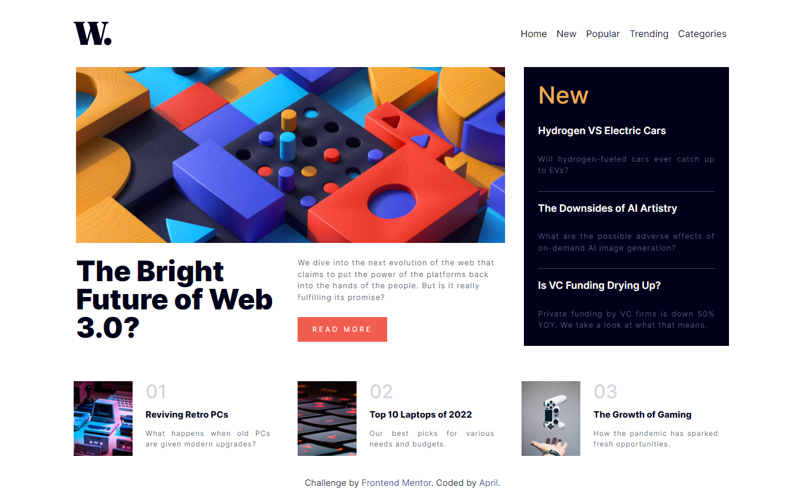

# Frontend Mentor - News homepage solution

This is a solution to the [News homepage challenge on Frontend Mentor](https://www.frontendmentor.io/challenges/news-homepage-H6SWTa1MFl).

## Table of contents

- [Overview](#overview)
  - [The challenge](#the-challenge)
  - [Screenshot](#screenshot)
  - [Links](#links)
- [My process](#my-process)
  - [Built with](#built-with)
  - [Useful resources](#useful-resources)
- [Author](#author)

## Overview

### The challenge

Users should be able to:

- View the optimal layout for the interface depending on their device's screen size
- See hover and focus states for all interactive elements on the page

### Screenshot

### Links

- Solution URL: [Add solution URL here](https://your-solution-url.com)
- Live Site URL: [Add live site URL here](https://64edfe2e3e31ff00a1ca5b95--thriving-capybara-13b85c.netlify.app/)

## My process

### Built with

- Semantic HTML5 markup
- CSS custom properties
- Flexbox
- CSS Grid
- Mobile-first workflow

### Useful resources

- [Color picker](https://fffuel.co/cccolor/) - This website helped to pick color by hsl, hsla,rgb, rgba, etc. I really liked those pallete and will use it going forward.
- [Stack overflow](https://stackoverflow.com/) - This is an amazing website which helped me finally find my errors and not working codes. I'd recommend it to anyone.

## Author

- Github - [its_aprilleon](https://www.github.com/its_aprilleon)
- Frontend Mentor - [@its-aprilleon](https://www.frontendmentor.io/profile/its_aprilleon)
